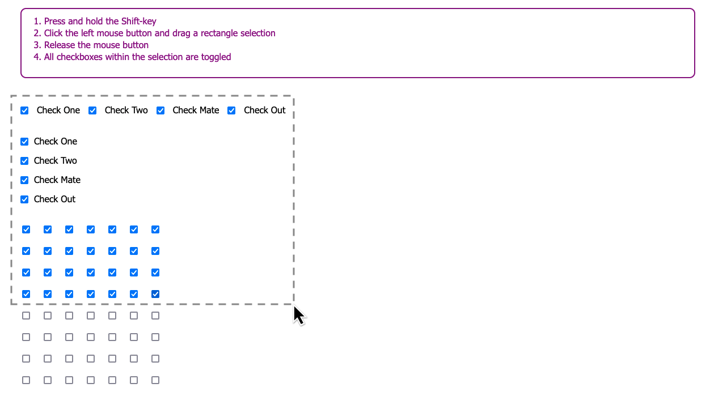

# Checkbox Selector

Firefox add-on which allows to select multiple checkboxes by click-and-dragging a rectangle-shaped selection with the mouse

## How to use
- Press and hold the Shift-key
- Click the left mouse button and drag a rectangle selection
- Release the mouse button
- All checkboxes within the selection are toggled

## Screenshot

## Link to Extension
[https://addons.mozilla.org/de/firefox/addon/checkbox-selector/](https://addons.mozilla.org/de/firefox/addon/checkbox-selector/)
